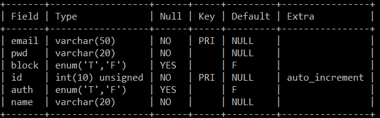
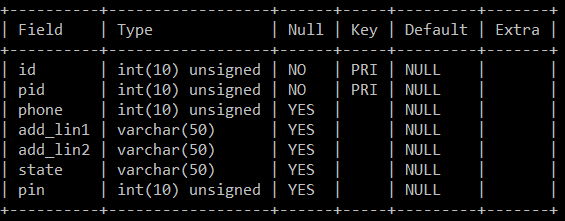
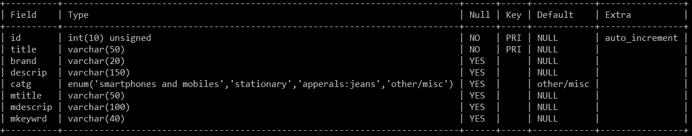
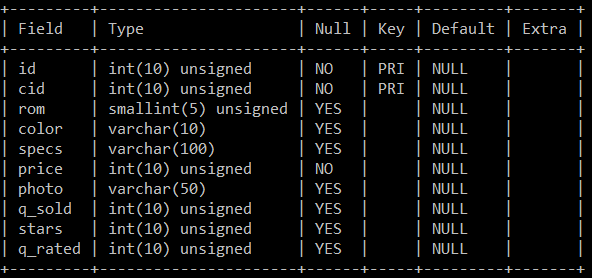

# E-commerce mobile responsive website with SEO features

The project will entail the development of a mobile responsive e-commerce website which will employ SEO (search engine optimization features). The website will cater to multiple categories of products. The website will also feature an integrated search and different client and admin panel. The website will be intuitive to user interface which will be easy to use.

#### -By Harsh Chaudhry and Anuj Kumar Talan
Anuj Kumar Talan's GitHub URL - <a href="github.com">https://github.com/anujtalan95/E-commerceSEO/</a>

## Features

* The website will be developed using a host of technologies such as HTML, JSP, Servlets, etc. 
* Frontend supported with HTML5, CSS3 and JQuery.
* A database will also be used to keep track of all client details along with product details. MySQL database will be used for the same.
* The website will be made mobile responsive to target the customers on the go and SEO features will be implemented to the website.
* The user will be able to sign up and all the data about the user’s activities will be logged till the time the user’s session does not expire.
* There will also be an admin panel for administrators who will be able to add, delete, alter products and block clients.
* Number of sales of each product will be tracked.
* Clients will be able to rate products and an average rating will be displayed for future clients.
* Clients will get a functioning cart who's data will be saved till the time user does not delete or purchase products.
* Clients will get the option to view all previous purchases.

## Database
#### Database engine used for all the tables is InnoDB
### Administrator table: admins

### Main Client table: client_m

### Client Details table: client_d

### Product Listing table: plist

### Product Category, Options & Details table: c_mobiles (only for smartphone category)

#### NOTE: seo.sql dump file has been included in the database folder, use MySQLDump to tranfer data. The database has not been populated and only has tables as of now.
